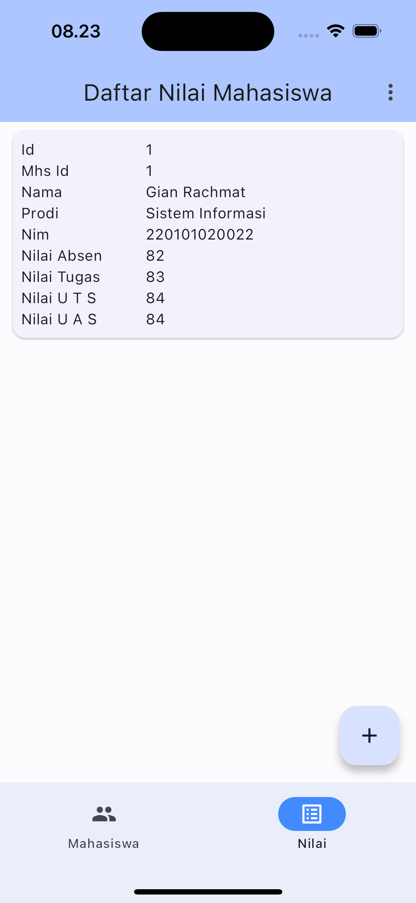
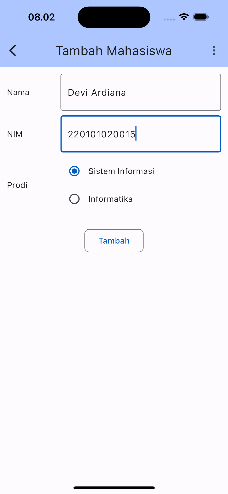
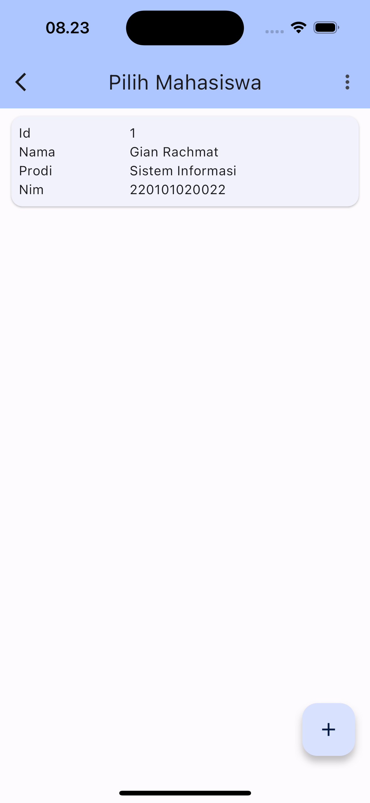
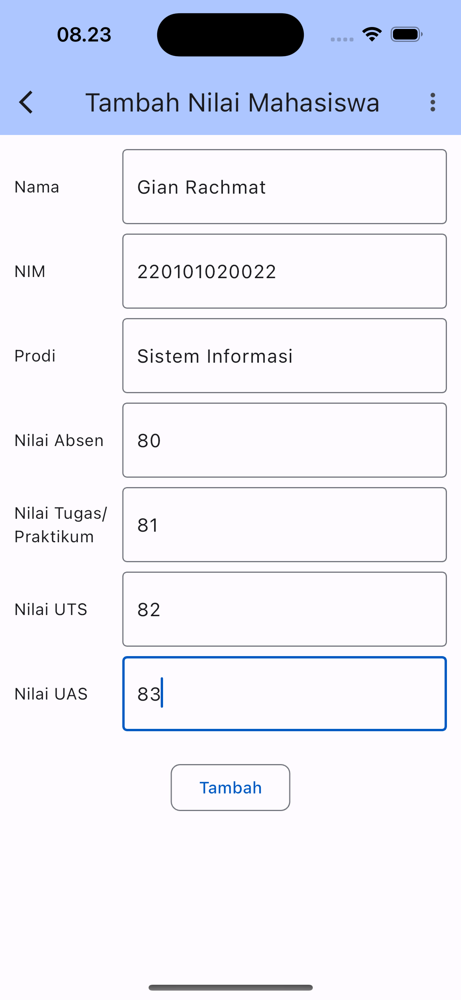
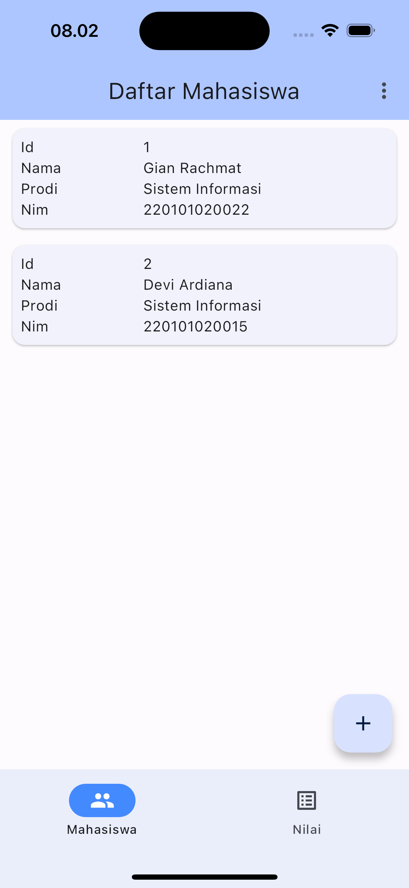
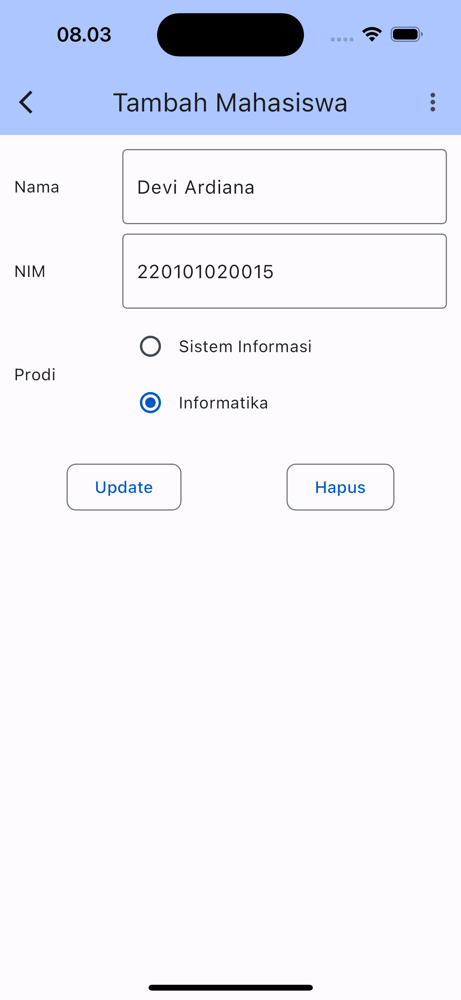
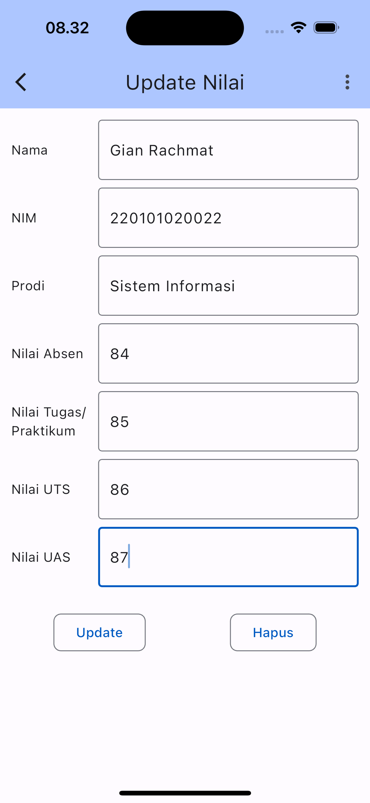
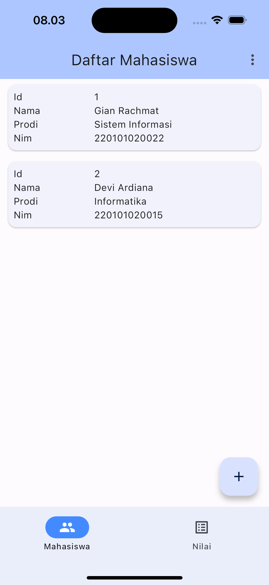
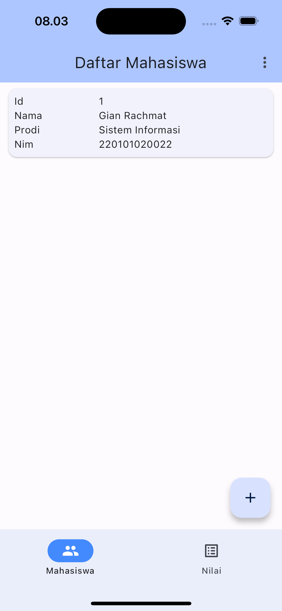

# UNSIA Tugas CRUD Flutter

Gian Rachmat Pradipta - 220101020022 - Pemrograman Berbasis Perangkat Bergerak.

# Database

~~~sqlite-sql
create TABLE nilai (
  id integer PRIMARY KEY not NULL,
  mhsId text,
  nilaiAbsen integer,
  nilaiTugas integer,
  nilaiUTS integer,
  nilaiUAS integer
);

create TABLE mhs (
  id integer PRIMARY KEY NOT NULL,
  nama text,
  nim integer,
  prodi text
);

insert into mhs (nama, nim, prodi) VALUES ('Gian Rachmat', '220101020022', 'Sistem Informasi');
insert into mhs (nama, nim, prodi) VALUES ('Devi Ardiana', '220101020015', 'Sistem Informasi');
insert into mhs (nama, nim, prodi) VALUES ('Rulando Rahardian', '220101020026', 'Informatika');
SELECT * from mhs;

insert into nilai (mhsId, nilaiAbsen, nilaiTugas, nilaiUTS, nilaiUAS) values (1, 80, 81, 82, 83);
insert into nilai (mhsId, nilaiAbsen, nilaiTugas, nilaiUTS, nilaiUAS) values (2, 84, 85, 86, 87);
insert into nilai (mhsId, nilaiAbsen, nilaiTugas, nilaiUTS, nilaiUAS) values (3, 87, 86, 85, 84);
select * from nilai;

select nilai.*, mhs.nama, mhs.nim, mhs.prodi from nilai join mhs on mhs.id = nilai.mhsId;

~~~

# Screenshot

| nama         | screenshot mahasiswa                                    | screenshot nilai                                                                                          |
|--------------|---------------------------------------------------------|-----------------------------------------------------------------------------------------------------------|
| list         |          |                                                          |
| tambah       |        |   |
| hasil tambah |  |                                                  |
| update       |        |                                                        |
| hasil update |  |                                                  |
| hasil hapus  |   |                                                   |
